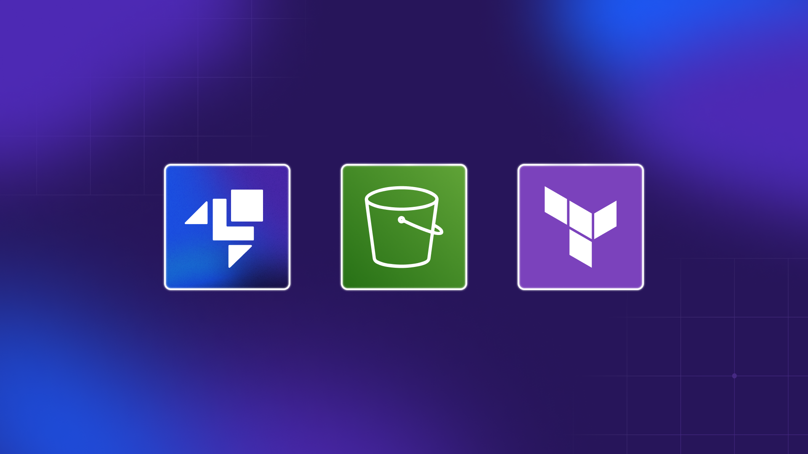

<h1 align="center">LocalStack - Terraform</h1>

<p align="center">
  
  
</p>

<p align="center">
  <a href="#-projeto">Projeto</a>&nbsp;&nbsp;&nbsp;|&nbsp;&nbsp;&nbsp;
  <a href="#-tecnologias">Tecnologias</a>&nbsp;&nbsp;&nbsp;|&nbsp;&nbsp;&nbsp;
  <a href="#-roadmap">Roadmap</a>&nbsp;&nbsp;&nbsp;|&nbsp;&nbsp;&nbsp;
  <a href="#-referências">Referências</a>
</p>

<p align="center">
  
</p>

## 💡 Projeto

- Host a static website locally using Simple Storage Service (S3) and Terraform with LocalStack

## ✨ Pré-requisitos

Comunidade LocalStack
Terraforma
awslocal

## 👣 Roadmap

- [ ] Instalar Terraform
- [ ] Executar container LocalStack
    - [ ] Criar um bucket chamado `testwebsite`
    - [ ] Habilitar a hospedagem de site estático
    - [ ] Anexar uma política ao bucket para permitir o acesso público e seu conteúdo
- [ ] Criar um site estático para exemplo
- [ ] Hospedando um site estático usando S3
    - [ ] Fazer upload dos arquivos para o bucket

## Commands

```bash
aws --endpoint-url=http://localhost:4566 s3api create-bucket --bucket testwebsite
aws --endpoint-url=http://localhost:4566 s3api put-bucket-policy --bucket testwebsite --policy file://bucket_policy.json 
aws --endpoint-url=http://localhost:4566 s3 sync ./ s3://testwebsite
aws --endpoint-url=http://localhost:4566 s3 website s3://testwebsite/ --index-document index.html --error-document error.html
```

## 📄 Referências

- [LocalStack](https://www.localstack.cloud/)